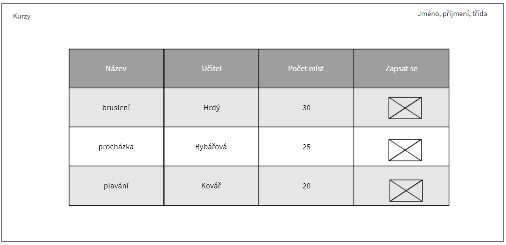

**Přihlašovací okno:** Slouží k přihlášení žáka/učitele/administrátora.  
**Žák:** Uvidí přehled kurzů, které učitelé již vytvořili. Pokud si žák libovolný kurz rozklikne, tak tam nalezne bližší informace o daném kurzu a bude mít možnost se tam zapsat. 
**Učitel:** Bude moct založit si svůj vlastní kurz, kde se žáci budou moci zapisovat. 
**Administrátor:** Bude mít přístup k úpravě již vytvořených kurzů. 

