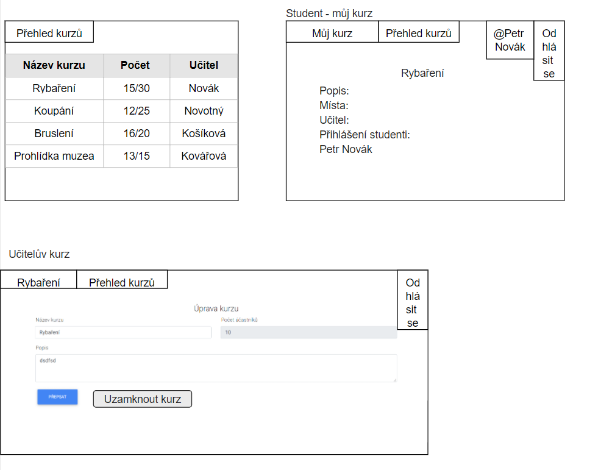
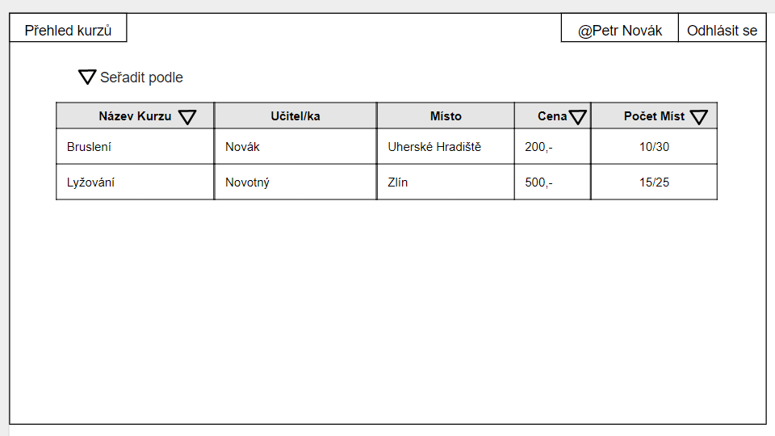
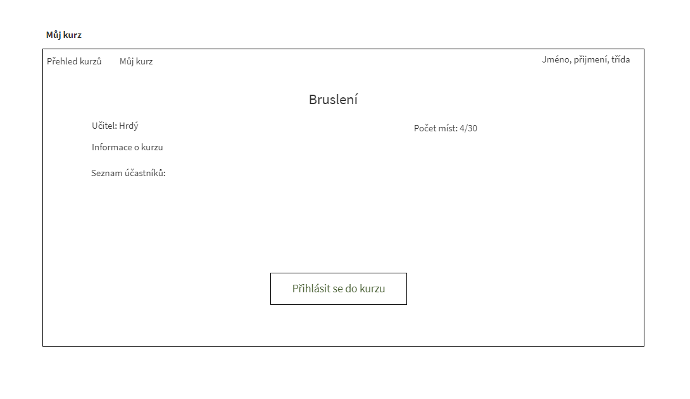

**Přihlašovací okno:** Slouží k přihlášení žáka/učitele/administrátora.  
**Žák:** Uvidí přehled kurzů, které učitelé již vytvořili. Pokud si žák libovolný kurz rozklikne, tak tam nalezne bližší informace o daném kurzu a bude mít možnost se tam zapsat. 
**Učitel:** Bude moct založit si svůj vlastní kurz, kde se žáci budou moci zapisovat. 
**Administrátor:** Bude mít přístup k úpravě již vytvořených kurzů. 

**Přehled kurzů:** Obsahuje všechny kurzy, které učitelé vytvoří. Ke každému kurzu žáci vidí učitele, který kurz pořádá a počet míst, kolik lidí je tam přihlášených z kolika.

**Můj kurz:** Obsahuje informace o kurzu, které budou srovnatelné s tím, pokud si žák daný kurz rozklikne, jen tam nebude tlačítko "přihlásit se do kurzu", pouze si bude moct znovu přečíst informace o kurzu, kde je zapsaný.

**Přehled kurzů** - U počtu účastníků se bude zobrazovat aktuální počet přihlášených z maximálního možné počtu účastníků
**Můj kurz** - Student po přihlášení do kurzu uvidí v menu "Můj kurz", který ho přesměruje najeho kurz.
**Učitelův kurz** - U kurzu učitele bude tlačítko zamnkout, které umožní učiteli zamknout kurz a díky tomu se nebudou moct do kurzu přihlašovat noví studenti.
