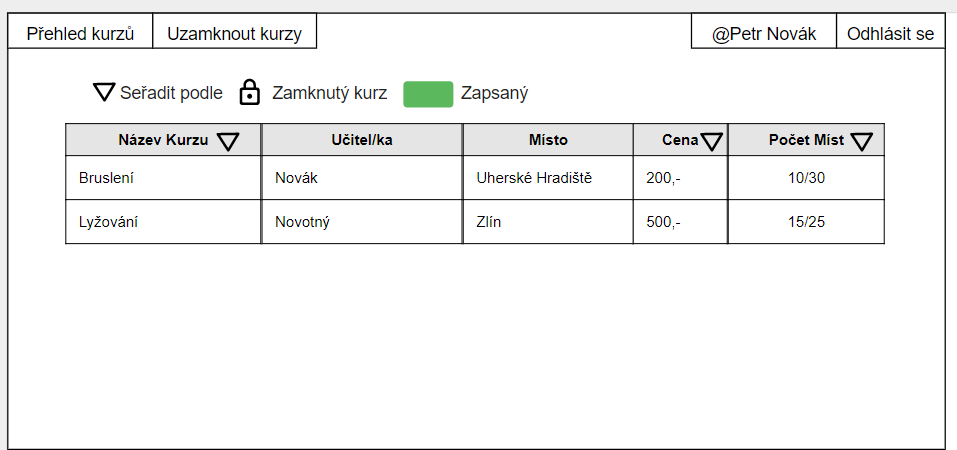
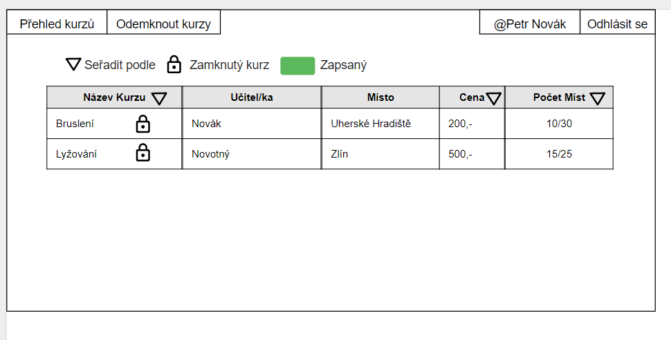

  
 Slouží k přihlášení studenta/učitele/administrátora.  
  
Obsahuje všechny kurzy, které učitelé vytvoří. Ke každému kurzu studenti vidí učitele, který kurz pořádá. Počet míst, kolik lidí je tam přihlášených z maximálního počtu, místo a cenu. Dále si student může jednotlivé kurzy seřazovat (například podle abecedy). 
  
Po rozkliknutí daného kurzu je možné vidět bližší informace.  
  
Student přihlášený do kurzu má kurz zbarvený v přehledu zelenou barvou a v menu se nachází název kurzu, do kterého se přihlásil. Po kliknutí na něj, se tam i přesměruje.  
  
Učitel si bude moct založit svůj vlastní kurz, kde se studenti budou moci zapisovat.  
  
Učitel po vytvoření kurzu může následně kurz upravovat i uzamknout.  
  
Administrátor bude mít možnost vymazat kterýkoliv kurz po rozkliknutí.  
  
Administrátor může kliknout na uzamknutí kurzů, zamkne tak všechny kurzy a znepřístupní přesuny z jednoho kurzu do druhého.
  
Po zamknutí všech kurzů se administrátorovi změní tlačítko na "odemknout" a pomocí toho může kurzy odemknout a opět zpřístupnit přesuny.
